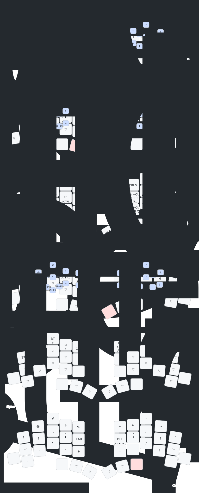

This is a ZMK firmware for a [TOTEM keyboard](https://github.com/GEIGEIGEIST/TOTEM), using a keymap that is pretty much copied from the base keymap of [urob's ZMK config](https://github.com/urob/zmk-config), since I'm only using 36 keys out of the 38. 

I re-added most of all the shortcuts from urob. I also use anymak:end, with b and v switched.

Finally, I stole the symbol layer from here: [https://github.com/ndonkersloot/zmk-config/tree/main](https://github.com/ndonkersloot/zmk-config/tree/main).

I'll see whether or not it works well.

here is the visual keymap, generated with https://keymap-drawer.streamlit.app/

I'm looking to add a dongle. I bought a prospector kit, but I burnt the chip while soldering...... look into this with one of my nicenanos?

https://github.com/englmaxi/zmk-dongle-display
